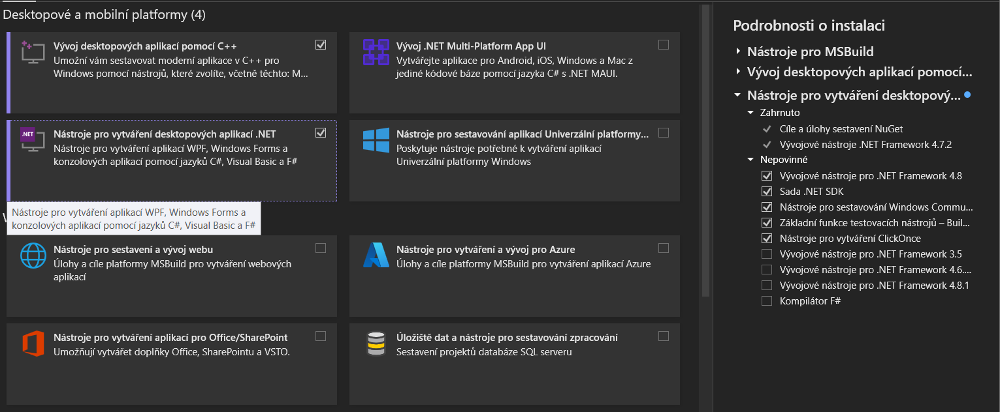

# Návod na instalaci potřebnýho SW

## VS 2022

Celý postup lze najít [zde](https://www.ducxinh.com/techblog/how-to-install-visual-studio-2022-on-windows:-a-comprehensive-guide-for-developers). 

### FAQ

##### 1. Jakou verzi stáhnout?

- Komunitní edici

##### 2. Co vše je potřeba nainstalovat?

- Sadu nástrojů pro vývoj desktopových aplikací **.NET** (vizte. Obrázek)

## JetBrains Rider (Alternativa VS 2022)

Postup [zde](https://www.jetbrains.com/help/rider/Installation_guide.html).